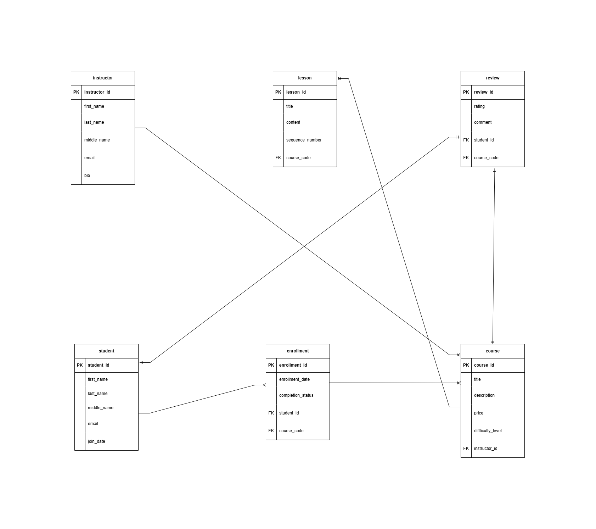

# Online Course Platform Database

A complete MySQL database for an e-learning business — designed from scratch, populated with realistic data, and exercised with real SQL questions across retrieval, filtering, aggregation, joins, and subqueries.

## Mission statement

The Online Course Platform database stores and organizes everything an e-learning business needs: who teaches, what is offered, who enrolls, how students progress, how they rate their experience, and what lessons each course contains. Its purpose is to turn raw enrollment, pricing, and review data into answers that drive business decisions.

## Mission objectives

1. Track every instructor and the courses they teach (price and difficulty level).
2. Record student enrollment, join date, and completion status.
3. Capture per-course, per-student feedback (rating 1–5 plus a comment).
4. Organize each course's content as ordered lessons.
5. Answer real business questions in SQL: revenue per instructor, most popular courses, silent students, best-rated courses.

## Key entities

| Entity | Role | Rows |
|---|---|---|
| instructor | The people who create and teach courses | 17 |
| course | What is sold — price, difficulty, taught by one instructor | 31 |
| student | The learners on the platform | 603 |
| enrollment | Who takes which course and their completion status | 603 |
| review | Student feedback, unique per student + course | 100 |
| lesson | Ordered content inside a course (sequence 1, 2, 3) | 93 |

## Entity relationship diagram



## How to run

Requirements: MySQL 8.4+ (built on MySQL 9.7.0).

1. Create the tables:

   ```sql
   SOURCE schema/create_tables.sql;
   ```

2. Load the data (FK-safe insert order):

   ```sql
   SOURCE data/insertdata.sql;
   ```

3. Start querying:

   ```sql
   USE online_course_platform_db;
   SOURCE queries/retrieval/joins.sql;
   ```

## Project structure

```
online_course_platform_db/
├── ER-Diagram-Online-Course-Platform.png
├── schema/
│   └── create_tables.sql          ← 6 CREATE TABLE statements
├── data/
│   └── insertdata.sql             ← all INSERTs, FK-safe order
├── queries/
│   └── retrieval/
│       ├── select_all_queries.sql       ← DESCRIBE ×6, SELECT * ×6
│       ├── basic_filters.sql            ← WHERE, LIKE, BETWEEN, IN, IS NULL
│       ├── sorting_limit.sql            ← ORDER BY, LIMIT
│       ├── summarize_aggregates.sql     ← GROUP BY, COUNT, AVG, ROUND, HAVING
│       ├── joins.sql                    ← INNER JOIN, LEFT JOIN, COUNT(DISTINCT)
│       └── subqueries.sql               ← IN, NOT IN, scalar, derived tables
└── screenshot/
    ├── data-retrieval/            ← query result screenshots
    └── schema desc img/           ← table structure screenshots
```

## Tech stack

- MySQL (9.7.0)
- InnoDB engine, primary/foreign keys, CHECK constraints, AUTO_INCREMENT
- Pure SQL — written and verified by hand in the MySQL CLI

---

Built and practiced while learning SQL from scratch: schema design, data modeling, and writing every query by hand.
